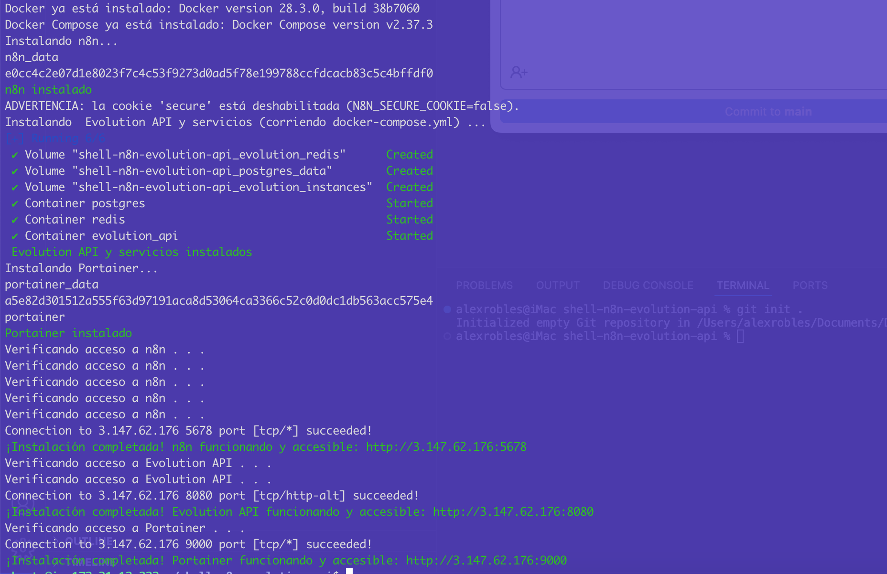
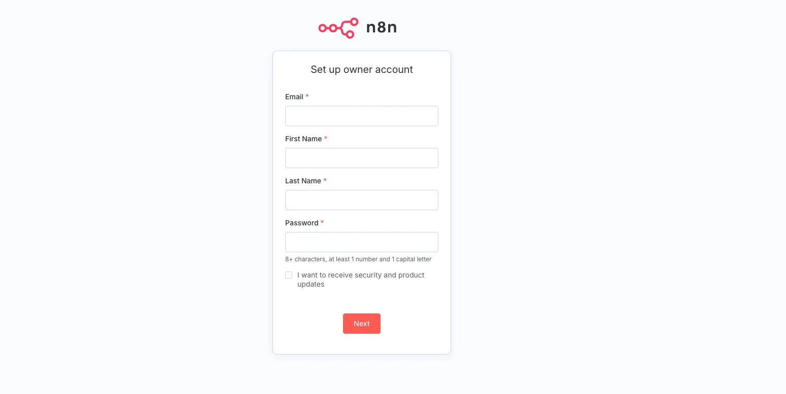
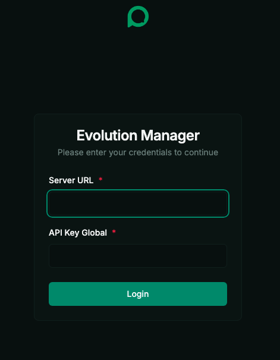
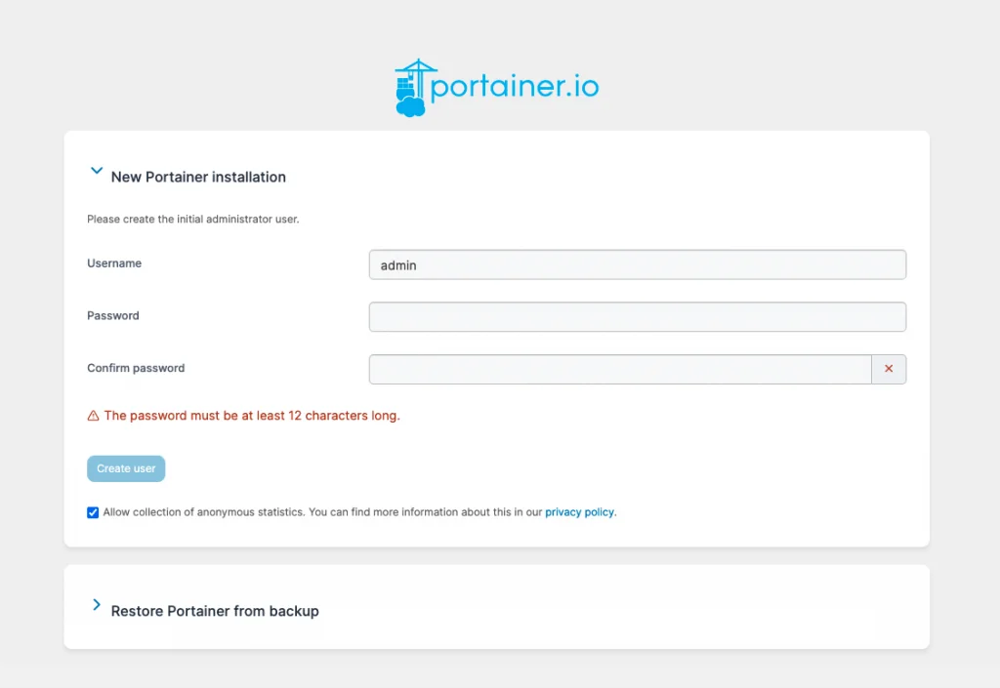

# Instalación Automática de Docker, Docker Compose, n8n, Evolution API y Portainer

Este repositorio proporciona un script Bash (`install.sh`) para instalar y configurar Docker, Docker Compose plugin, n8n, Evolution API y Portainer en servidores basados en Ubuntu.

## Requisitos previos

- Sistema operativo: Ubuntu 18.04, 20.04, 22.04, 24.04 (u otra versión compatible con los repositorios oficiales de Docker)
- Acceso con usuario que tenga privilegios de sudo
- Conexión a Internet desde el servidor

## Contenido del repositorio

- `install.sh`: script que automatiza la instalación.

### 1. Descargar o clonar el repositorio

```bash
git clone https://github.com/devalexcode/shell-n8n-evolution-api.git
```

### 2. Ingresa a la carpeta del proyecto

```bash
cd shell-n8n-evolution-api
```

### 3. Crea el archivo `.env`

```bash
cp .env.example .env
```

**3.1 ⚙️ Configuración del archivo `.env`**

Antes de levantar los servicios, asegúrate de crear y configurar tu archivo `.env`:

```bash
nano .env
```

Edita el archivo `.env` con tus propios valores:

```dotenv
############################################
# n8n
############################################

# ------------------------------------------
# Si quieres que se utilice automáticamente la dirección IP pública de tu servidor,
# deja N8N_URL="PUBLIC_IP". De lo contrario, reemplaza el valor por una URL válida
# (incluyendo protocolo y puerto si aplica. Ejemplo: http://mi-server-vps.com:5678).

N8N_URL="PUBLIC_IP"
# ------------------------------------------
N8N_PORT=5678 # Puerto donde se expone la interfaz web de n8n
# ------------------------------------------
N8N_TIME_ZONE="America/Mexico_City" # Zona horaria para n8n (asegúrate de usar la sintaxis de TZ válida)
# ------------------------------------------

############################################
# Evolution API
############################################

# ------------------------------------------
AUTHENTICATION_API_KEY=api_key # Clave de autenticación para Evolution API (Contraseña de administrador)
# ------------------------------------------
EVOLUTION_API_PORT=8080 # Puerto de escucha para Evolution API
# ------------------------------------------
CONFIG_SESSION_PHONE_VERSION=2.3000.1023204200 # Whatsapp Web version for baileys channel: https://web.whatsapp.com/check-update?version=0&platform=web
# ------------------------------------------

############################################
# PostgreSQL
############################################

# ------------------------------------------
POSTGRESS_USER=user # Usuario de PostgreSQL (POR SEGURIDAD MODIFICA ESTE VALOR)
# ------------------------------------------
POSTGRESS_PASS=123456 # Contraseña de PostgreSQL (POR SEGURIDAD MODIFICA ESTE VALOR)
# ------------------------------------------
POSTGRESS_PORT=5432 # Puerto de PostgreSQL (Se sugiere no modificar)
# ------------------------------------------

############################################
# Redis
############################################

REDIS_PORT=6379 # Puerto de Redis (Se sugiere no modificar)

############################################
# Portainer
############################################

PORTAINER_PORT=9000 # Puerto donde se expone el panel de Portainer (Se sugiere no modificar)

```

### 4. Dar permisos de ejecución al script

```bash
chmod +x install.sh
```

### 5 Ejecutar el script

```bash
./install.sh
```

- El script actualizará el sistema, instalará Docker y sus herramientas, añadirá el usuario al grupo `docker` desplegará n8n, Evolution API y Portainer.



## Ingresar a n8n

Al finalizar, verás un mensaje indicando la URL de acceso a Portainer:

```bash
¡Instalación completada! n8n funcionando y accesible: http://<IP_DEL_SERVIDOR>:N8N_PORT
```



## Ingresar a Evolution API

Al finalizar, verás un mensaje indicando la URL de acceso a Evolution API:

```bash
¡Instalación completada! Evolution API funcionando y accesible: http://<IP_DEL_SERVIDOR>:EVOLUTION_API_PORT
```



> ℹ️ **Nota:** Para ingresar al administrador de Evolution API ingresa al apartado /manager. Ejemplo: http://{IP_DEL_SERVIDOR}:{EVOLUTION_API_PORT}/manager

## Ingresar a Portainer

Al finalizar, verás un mensaje indicando la URL de acceso a Portainer:

```bash
¡Instalación completada! Portainer funcionando y accesible: http://<IP_DEL_SERVIDOR>:PORTAINER_PORT
```



¡Listo! Con estos pasos tu servidor quedará con n8n, Evolution API instalados y preparados para gestionar contenedores Docker a través de Portainer.

## 👨‍💻 Autor

Desarrollado por [Alejandro Robles | Devalex ](http://devalexcode.com)  
¿Necesitas que lo haga por ti? ¡Estoy para apoyarte! 🤝 https://devalexcode.com/soluciones/n8n-en-servidor-vps

¿Dudas o sugerencias? ¡Contribuciones bienvenidas!
